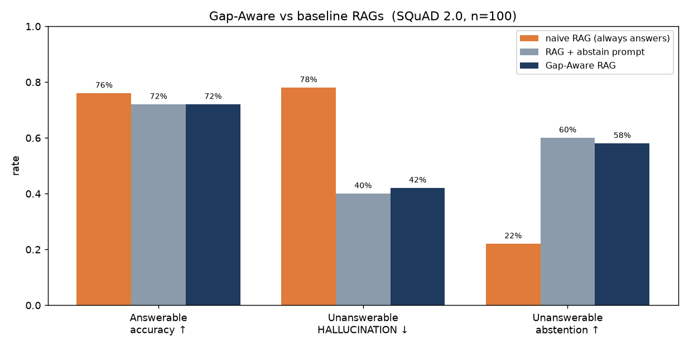
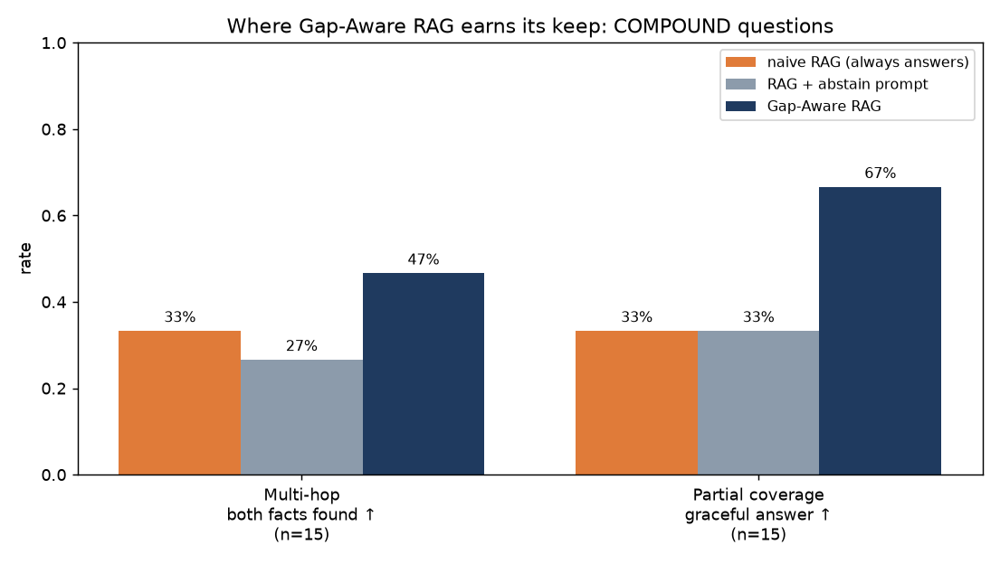
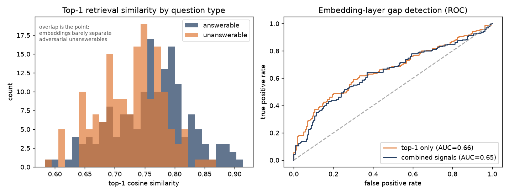

# Gap-Aware Agentic RAG

A retrieval-augmented system that models **the boundary of its own knowledge**.
Instead of always answering, it decomposes a question, checks each part against
the corpus, and **answers the parts it can while naming the parts it can't** —
rather than hallucinating a confident answer.

Runs fully local on an 8 GB laptop (Ollama: `nomic-embed-text` embeddings,
`qwen2.5:7b` reasoning) with an optional hosted-LLM backend (Groq) for faster
evaluation. No FAISS, no paid APIs required.

## Results

Evaluated on a **real corpus** — 540 Wikipedia chunks from SQuAD 2.0 (Harvard,
EU law, the immune system, Sky UK) — against two baselines:

- **naive RAG** — retrieves top-k, always answers from context.
- **RAG + abstain prompt** — same retrieval, but the LLM is *told* it may reply
  "I don't know." This is the cheap, strong baseline any reviewer asks for, and
  the bar the architecture actually has to clear.

### Finding 1 — on single-fact questions, a one-line abstain prompt is already strong

On 100 single-fact questions (50 answerable + 50 adversarial unanswerable),
**the full Gap-Aware system and a one-line abstain prompt are a statistical tie:**



| Metric (single-fact) | naive | RAG + abstain prompt | Gap-Aware |
|---|---|---|---|
| Answerable accuracy ↑ | 76% | 72% | 72% |
| Unanswerable **hallucination** ↓ | 78% | **40%** | 42% |
| Unanswerable abstention ↑ | 22% | 60% | 58% |

The honest takeaway: against the *always-answer* naive baseline, gap-awareness
roughly halves hallucination (78% → 42%) — but **almost all of that is just
"being allowed to abstain."** A single prompt line recovers it. On flat,
single-fact QA the elaborate calibration + verification machinery does not earn
its cost. Worth knowing, and worth saying out loud.

### Finding 2 — on compound questions, decomposition + per-part verification wins

The architecture earns its keep where a single prompt *structurally cannot*
compete: **compound questions**, evaluated in two flavours.



| Metric (compound) | naive | RAG + abstain prompt | **Gap-Aware** |
|---|---|---|---|
| **Multi-hop** — both facts found ↑ | 33% | 27% | **47%** |
| **Partial coverage** — graceful answer ↑ | 33% | 33% | **67%** |

- **Multi-hop** (two facts in *different* paragraphs): single-shot retrieval
  grabs chunks for one part and misses the other. Decomposing into
  sub-questions and retrieving each separately finds **both** facts far more
  often (47% vs 27–33%).
- **Partial coverage** ("X *and* Y?" where X is in the corpus and Y genuinely
  isn't): the right move is to answer X **and** name the Y-gap. A single prompt
  is all-or-nothing and **fails in two opposite ways** — it either abstains on
  everything (losing X) or answers everything (fabricating Y). The agent does
  both correctly **2× more often** (67% vs 33%):

```
Q: "When did OLAF investigate John Dalli?  And what year did Ireland agree to
    the Treaty of Lisbon changes?"   (first fact present, second absent)

  RAG + abstain prompt ->  "I don't know."            # loses the answerable fact
  naive RAG            ->  "...context does not provide information..."  # same
  Gap-Aware RAG        ->  - OLAF investigated John Dalli -> 2012  [source: EU_law__7]
                           - Not covered by the corpus: the Ireland / Lisbon year
```

```
Q: "How are antibodies transferred to an infant's gut?  And what only exists
    outside jawed vertebrates?"      (first present, second absent)

  naive / abstain ->  "...breast milk. VLRs only exist outside jawed vertebrates."
                                                        # FABRICATES the 2nd fact
  Gap-Aware RAG   ->  - transferred via breast milk or colostrum  [source: Immune_22]
                      - Not covered by the corpus: what exists outside jawed vertebrates
```

**Bottom line:** gap-awareness is not free hallucination insurance for any RAG —
on single-fact QA a prompt does the job. Its value shows up on compound and
partially-answerable questions, where answering-what-you-know-and-naming-what-you-
don't is a *structural* capability, not a prompt you can write.

### Why this is hard: embeddings barely see the gap

The adversarial unanswerables are on-topic but factually absent, so at the
embedding layer they look almost identical to answerable questions:



A pure embedding gap-detector scores only **ROC-AUC 0.66** (top-1 similarity) /
**0.65** (combined coverage signals, 5-fold CV) — barely above chance. That is
*why* the system needs an LLM verification layer reading the retrieved passage,
not just a similarity threshold.

Reproduce: `eval/eval_separation.py` (Tier A), `eval/eval_endtoend.py`
(single-fact), `eval/eval_compound.py` (compound).

## How it works

```
Question
   │  decompose (only if compound; else verbatim)         gaprag/agent.py
   v
for each sub-question:
   INSTRUMENTED RETRIEVER -- coverage signals --> GAP DETECTOR (calibrated)
      top1 / score_gap / density / concentration    ANSWERABLE / PARTIAL / GAP
   │                                                      │ (prior, not a gate)
   v                                                      v
   LLM GROUNDING VERIFICATION  -> supported fact (+source)  |  named gap
   │
   v
COMPOSE: verified facts with provenance  +  "Not covered by the corpus: …"
```

Two ideas do the work:

1. **Calibrated gap detection.** Retrieval is instrumented with coverage signals
   (`top1`, `score_gap`, `density`, `concentration`); answerability is judged
   against *what an answerable query looks like in this corpus*, not a hard-coded
   threshold.
2. **The gap verdict is a prior, not a gate.** An LLM verifier reads the
   retrieved passage and is the arbiter — so the embedding layer's mistakes
   (it over-flags 16% of answerables) get rescued, and the factual gaps it
   *can't* see get caught.

## The thesis, in one example

`Who is the CEO?` (present) and `Who is the CFO?` (absent) embed almost
identically, retrieve the *same* leadership chunk, and both get the
embedding-layer verdict **GAP**. Embeddings see topical coverage, not factual
coverage. Verification separates them:

| Question | Embedding verdict | After LLM verification |
|---|---|---|
| Who is the CEO? | GAP | **answered:** "Mara Delacroix" |
| Who is the CFO? | GAP | **abstains** (fact not in passage) |
| How long does the battery last? | PARTIAL | **answered:** "about 6 hours" (not the 75-min charging distractor) |

Tuning thresholds can't separate CEO from CFO; architecture can.

## Nine lessons learned (the deep part)

1. **nomic-embed-text needs task prefixes.** Documents → `search_document: `,
   queries → `search_query: `. Without them similarity collapses and *everything*
   looks like a gap. (`embeddings.py`)
2. **The calibration yardstick must match the query distribution.** Calibrating
   query→doc scores against doc→doc similarity is apples to oranges — short
   questions never land as close as two paragraphs do. (`index.py`)
3. **Use realistic pseudo-queries.** Re-embedding whole chunks as queries is
   unrealistically easy; ask a small LLM for the short questions each chunk
   answers and calibrate against *those*. (`calibrate.py`)
4. **Chunk granularity dominates precision.** 700-char multi-topic chunks dilute
   facts; ~320-char chunks let a pointed question find its pointed answer.
   (`config.py`)
5. **Small models over-decompose.** `qwen2.5:3b` rewrites simple questions and
   invents conditions, manufacturing fake gaps. Gate decomposition behind a
   compound-question heuristic and force verbatim splitting. (`agent.py`)
6. **Verification needs a capable model.** 3b confuses similar facts and
   flip-flops on presence; the grounding step uses `qwen2.5:7b`.
7. **One warm model beats mixing sizes.** On 8 GB CPU, switching 3b/7b per call
   reloads 4.7 GB from disk every time. One model, warmed once. (`scripts/demo_agent.py`)
8. **The gap verdict is a prior, not a gate.** Hard-abstaining on a GAP verdict
   kills the very case verification exists for. (`agent.py`)
9. **Benchmark against a *fair* baseline — it changes the story.** The first
   "78% → 42% hallucination" headline was measured against a naive baseline
   forbidden to abstain. Adding a one-line abstain prompt erased most of the
   gap on single-fact QA and forced the honest, sharper claim: the architecture
   wins on **compound** questions, not flat ones. The fair baseline is what makes
   the result credible. (`eval/eval_endtoend.py`, `eval/eval_compound.py`)

## Run

```bash
# Demos on the controlled "Aurelia Robotics" corpus
uv run python scripts/demo_gap.py      # embedding-layer gap detection
uv run python scripts/demo_agent.py    # full agent: verify + abstain

# Reproduce the evaluation (SQuAD 2.0)
uv run python scripts/build_index_squad.py     # build + calibrate index (~12 min)
uv run python eval/eval_separation.py          # Tier A: embedding separation (ROC-AUC)
uv run python eval/eval_endtoend.py 50         # single-fact: 3-system comparison, n=100
uv run python eval/build_compound.py 15        # synthesize compound questions
uv run python eval/eval_compound.py            # compound: multi-hop + partial coverage
uv run python eval/make_plots.py               # render the figures above

# Optional: route verification through Groq instead of local 7b (faster eval)
GAPRAG_LLM_BACKEND=groq uv run python eval/eval_endtoend.py 50   # needs GROQ_API_KEY
```

Every eval streams to `eval/results/*.jsonl` and is **resumable** — a timeout or
rate-limit mid-run loses nothing.

## Layout

```
gaprag/
  config.py        # tunables (models, chunking, gap thresholds, LLM backend)
  embeddings.py    # Ollama embeddings with the required task prefixes
  index.py         # numpy vector store + calibrated answerable-query distribution
  ingest.py        # chunk -> embed -> calibrated Index
  calibrate.py     # LLM-generated realistic pseudo-queries for calibration
  retriever.py     # instrumented retrieval + coverage signals
  gapdetector.py   # coverage signals -> calibrated verdict   <- novel core
  agent.py         # decompose -> retrieve+assess -> LLM verify -> compose
  llm.py           # chat backend (local Ollama or hosted Groq, with 429 backoff)
scripts/           # demos + SQuAD index builder
eval/              # questions + Tier A / single-fact / compound harness + plots
corpus_squad/      # real corpus (540 Wikipedia chunks from SQuAD 2.0)
data/              # fictional Aurelia Robotics corpus (controlled gaps)
```
